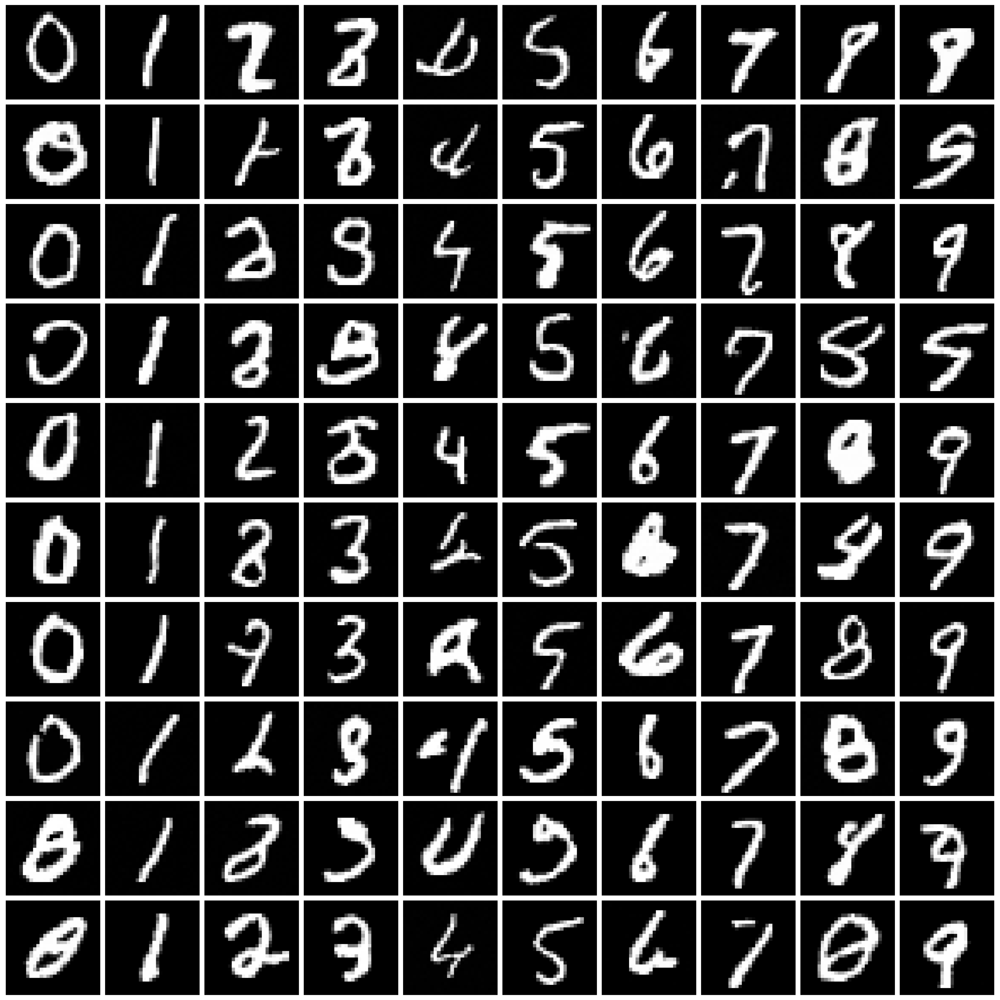
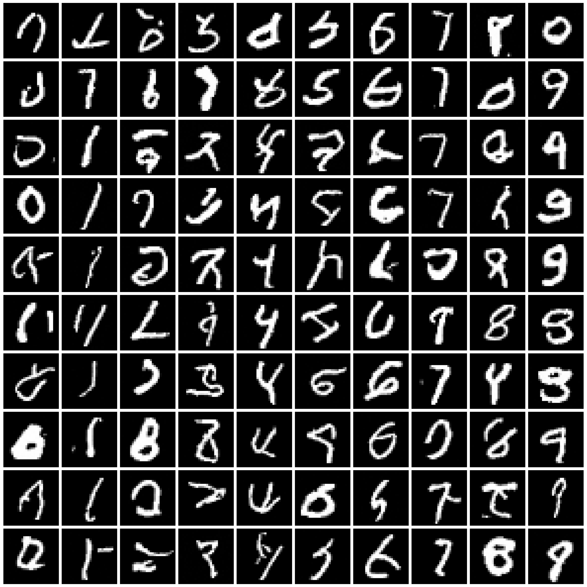
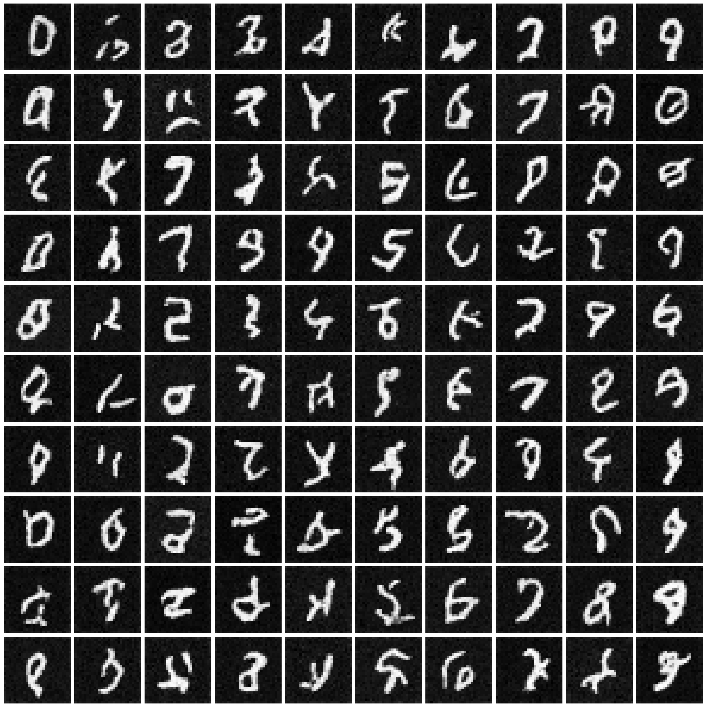
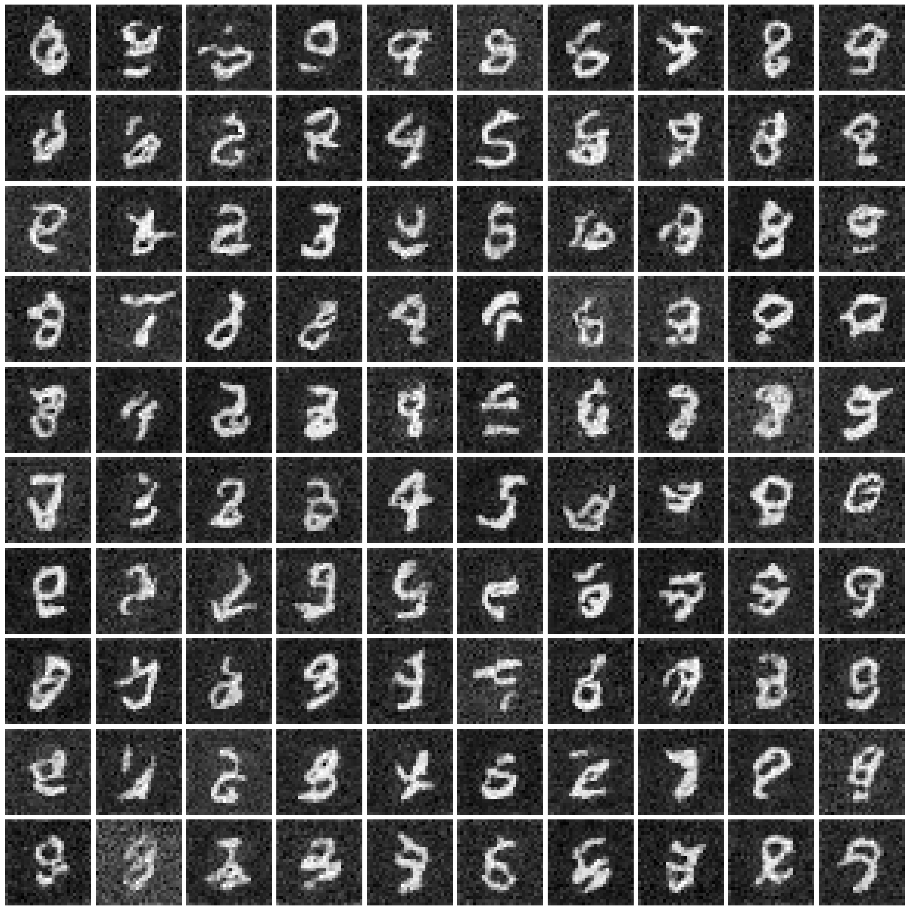

**Back to [home page](./README.md)**

## Additional Conclusions

We discuss three more conclusions aside from those presented in the main paper.

**All approaches suffer, but at different rates.**
We direct readers to Table 4 in our main paper for the reference of the following conclusions. As the privacy requirement becomes more stringent (decreased $\varepsilon$), we observe a consistent decrease in the utility and fidelity of the synthesized data produced by all approaches. This highlights the tradeoff between privacy and utility, and suggests that a careful balancing of these factors is necessary when synthesizing data for privacy-sensitive applications. However, it is worth noting that these approaches do not degrade uniformly as privacy requirements become more stringent. Specifically, DP-CGAN and GS-WGAN experience a significant degradation in performance when $\varepsilon$ drops from 10 to 1, whereas DP-Sinkhorn begins to degrade when $\varepsilon$ dropped from 1 to 0.2. Remarkably, DP-MERF maintains good performance even at an $\varepsilon$ value of 0.2. These differences suggest that there may be opportunities to select or design different approaches based on the specific privacy and utility needs of a given application.

**High perceptual quality is not necessary for classification.**
We present the synthesized images produced by DPGEN, as well as the measured utility and fidelity of the synthesized images in Table 1 below. Despite the significant drop in image perceptual quality as $\varepsilon$ decreases to 1 and 0.2, the classification accuracy (especially that of CNN) remains high. (In fact, DPGEN achieves the highest CNN classification accuracy across all approaches on MNIST dataset.) This indicates that the synthesized images contain some patterns/features that can be easily picked up by CNNs, even though they are not easily comprehensible to humans. 

We further note that the performance of weaker classifiers (MLPs and other scikit-learn classifiers denoted as "Avg") correlate well with the perceptual quality of images. Therefore, evaluating synthetic data with only these weak classifiers could lead to biased conclusions. It is important to carefully evaluate synthetic data using a range of classifiers, including stronger ones like CNNs, to ensure that any conclusions drawn are robust and unbiased.

Table 1: **DPGEN**: synthesized images, classification accuracy, and FID score

| | Non-private         | $\varepsilon=10$ | $\varepsilon=1$ | $\varepsilon=0.2$ |
|--|-----------------|---------------|---------------|---------------|
|Image|  |  |  |  |
| MLP acc | 95.7 | 95.0 | 92.3 | 79.8 | 
| CNN acc | 98.2 | 98.2 | 97.6 | 96.1 | 
| Avg acc | 83.5 | 78.5 | 48.5 | 36.5 | 
| FID | 6.2 | 9.3 | 125.5 | 183.1 |

**Approach selection is highly dependent on the dataset characteristic.**
We again direct readers to Table 4 in our main paper. DPGEN achieves the best performance across all scenarios on MNIST, but fails to perform well on Fashion-MNIST. On the other hand, DP-MERF emerges as the top-performing approach on Fashion-MNIST and is the second-best on MNIST. These results suggest that the effectiveness of different approaches may be highly dependent on the specific characteristics of the data being synthesized. For example, the differences in distribution and feature space between MNIST and Fashion-MNIST may have influenced the performance of each approach. As such, careful evaluation and selection of an appropriate approach for a given task is crucial.
