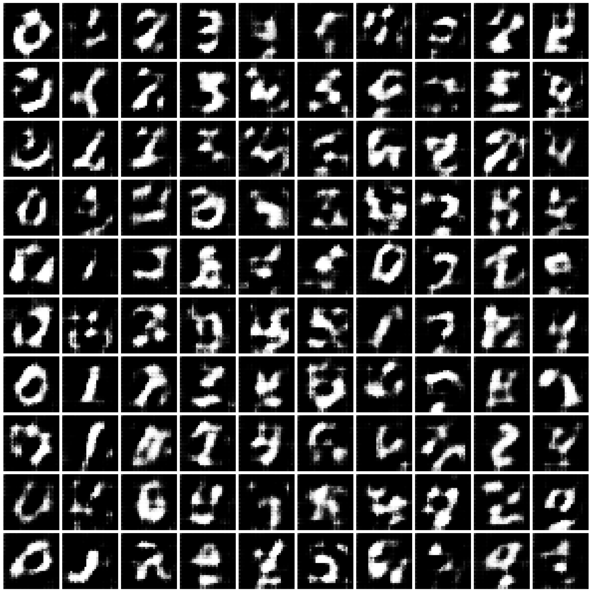
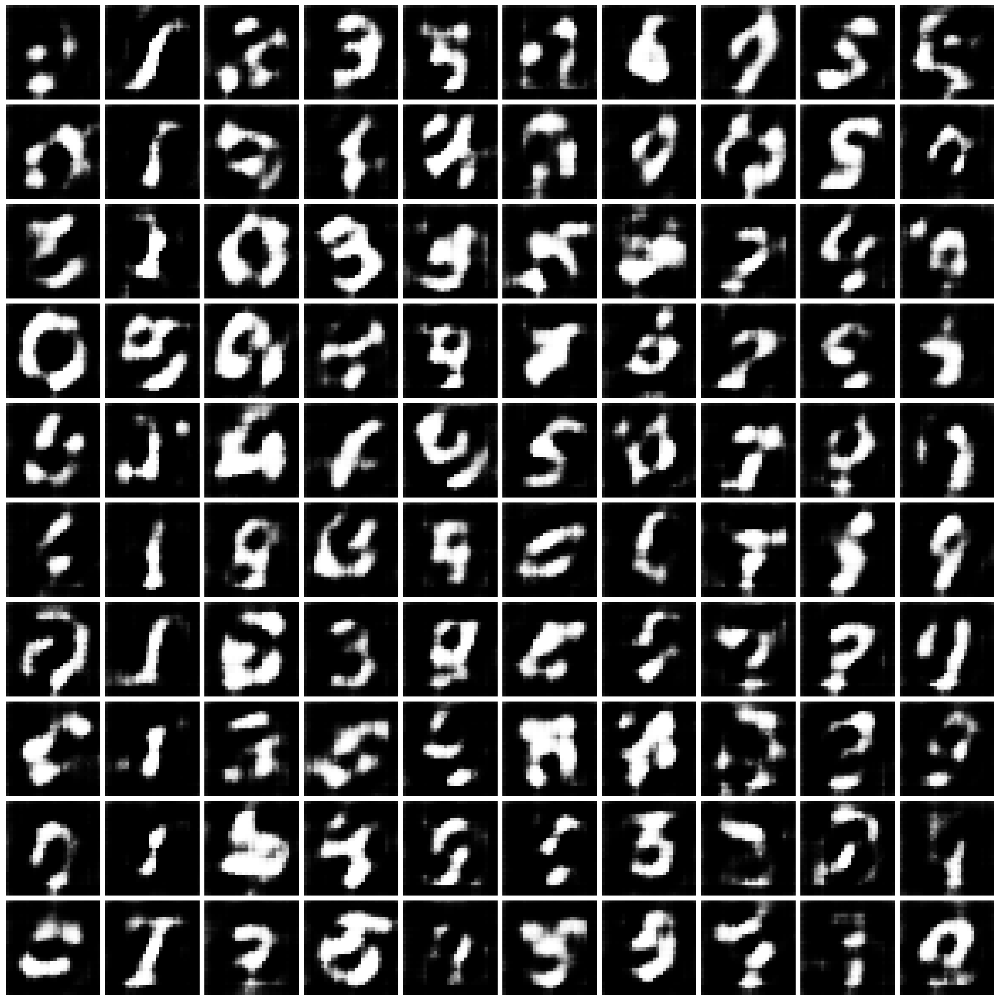

## Additional Details on Experimental Setups

### Table of Contents
- [More Details on Inclusion \& Exclusion Criteria](#more-details-on-inclusion--exclusion-criteria)
- [Hyper-Parameters Tuning and Selection](#hyper-parameters-tuning-and-selection)
- [Configurations and Hyper-Parameters for the Classifiers for Evaluation](#configurations-and-hyper-parameters-for-the-classifiers-for-evaluation)
- [References](#references)

### More Details on Inclusion & Exclusion Criteria

We describe our approach to method selection.

We aim to build a comprehensive benchmark covering all PPDS milestone approaches from the papers accepted at top ML & security conferences. 

1. We first filtered down the approaches by their publication venue (top ML & security conferences) and their references. In this step, we excluded some recent works that are covered in our review but are not accepted at any venue yet (e.g., DPDM [1] and DP-MEPF [2]). But we retained the works that have high citations though not published (e.g., DPGAN [3]).

2. We then excluded the approach that is known to have issues in privacy analysis. Concretely:

    - The privacy analysis of P3GM [4] "relies on the use of Wishart noise on sample covariance matrices, which has been proven to leak privacy [5]", as pointed out by Cao et al. [6].

3. Next, We searched for released code implementations and excluded the approaches that do not have available code repositories on GitHub, e.g., PEARL [7].

4. We then made an initial attempt to run each approach following their README and using their reported hyper-parameters on their evaluated settings. We exclude the approaches that fail to work or show significant discrepancy in our re-implementation, in order to avoid unfairly representing their method. Concretely, 

   - We found that PATE-GAN [8] is unable to learn the image distributions though they can work for tabular datasets. Chen et al. [9] reported the same finding in their Appendix D.3 and provided possible explanations. We refer readers to their paper for the details.
   - For G-PATE [10] and DataLens [11], there is significant gap between our results and those reported in their paper. For MNIST under $\varepsilon=10$, when using G-PATE, our obtained CNN accuracy is 42.0\% vs. their reported 80.9\%; when using DataLens, our obtained CNN accuracy is 53.9\% vs. their reported 80.7\%. We attach the figures including the synthesized data in Fig. 1 for reference. We tried a few other hyper-parameters but failed to gain similar results as well.
     - Chen et al. [9] included the evaluation result of G-PATE on MNIST under $\varepsilon=10$ in their Table 1. The accuracy value is 51\%, not matching up to that reported in the G-PATE paper as well.
     - The reason for the discrepancy in our trial might be due to the difference in the expriment environment---we were using TensorFlow 1.15 instead of TensorFlow 1.14 as stated in their repository. We were using the TensorFlow release maintained by Nvidia [12] instead of the Google official one due to failure to run.

5. In the end, we obtained a list of six approaches, with three (DPGAN [3], DPCGAN [13], and GS-WGAN [8]) under the category of minimax training (Section 4.5), one (DP-MERF [14]) under feature alignment (Section 4.2), one (DPGEN [15]) under stochastic simulation (Section 4.3), and one (DP-Sinkhorn [16]) under optimal transport (Section 4.4).

Figure 1. **Synthesized Images** by G-PATE and DataLens when trained on MNIST under $\varepsilon=10$.

| G-PATE         | DataLens                        |
|-----------------|---------------------------------|
|  | 

### Hyper-Parameters Tuning and Selection

We introduce our procedure of hyper-parameter tuning and selection.

**Hyper-parameter tuning**: We tune batch size, noise amplifier, gradient clipping norm, and other algorithm-specific hyper-parameters. For the combination of each approach and each scenario, we tune ~10 sets of hyper-parameters. 

**Hyper-parameter selection**: The difficulty of hyper-parameter selection is mainly due to there not existing one sole evaluation criteria for the synthesized data. Particularly, we evaluate synthesized data against 13 classifiers (CNN, MLP, and other 11 scikit-learn classifiers). We describe our approach to evaluation and hyper-parameter selection as follows:

1. We first measureed the accuracy of the synthesized data against three "good" classifiers---MLP, LDA, and logistic regression---whose performance are among the top in 13 classifiers. For these three classifiers, we used default hyper-parameters (see [the next section](#configurations-and-hyper-parameters-for-the-classifiers-for-evaluation)) without further tuning them. After training, we took the average accuracy of three classifiers. 

2. For each combination of an approach and a scenario, we selected the top 3~5 sets of hyper-paramters based on their performance on the above metric (i.e., average accuracy on the three classifiers).

3. For the remaining 3~5 sets of hyper-parameters, we then trained CNNs on them. For training CNNs, we tuned the learning rate. We selected the best accuracy over all sets of CNN hyper-parameters.

4. We selected the best hyper-parameter based on the performance in step 1 and step 3. We then evaluate this hyper-parameter on the remaining 9 classifiers. Note that we repeat the data generation and classifier training for 5 times and take the average for our final evaluation.

We report the sets of hyper-parameters we experimented with and the best set of hyper-parameters we selected in [Evaluation Results](./evaluation_results.md).

### Configurations and Hyper-Parameters for the Classifiers for Evaluation

We describe our configurations and hyper-parameters for the 13 classifiers for evaluation.

1. **CNN**: We used the evaluation code [``eval_cnn.py``](https://github.com/DingfanChen/GS-WGAN/blob/main/evaluation/eval_cnn.py) in the repository of [9]. The CNN architecture is LeNet [17]. We tuned the learning rate of the CNN training, among 0.01, 0.02, 0.05, and 0.1.

2. **MLP**: We used the scikit-learn MLP classifier (neural_network.MLPClassifier) with the default hyper-parameters.

3. **logistic_reg, random_forest, gaussian_nb, bernoulli_nb, linear_svc, decision_tree, lda, adaboost, bagging, gbm, xgboost**: We used the scikit-learn classifiers. We follow the implementation of [``synth_data_benchmark.py``](https://github.com/ParkLabML/DP-MERF/blob/master/code_balanced/synth_data_benchmark.py) in the repository of DP-MERF [14] and used the same hyper-parameters for these classifiers.

### References

[1] Dockhorn, Tim, et al. "Differentially private diffusion models." arXiv preprint arXiv:2210.09929 (2022).

[2] Harder, Fredrik, et al. "Differentially private data generation needs better features." arXiv preprint arXiv:2205.12900 (2022).

[3] Xie, Liyang, et al. "Differentially private generative adversarial network." arXiv preprint arXiv:1802.06739 (2018).

[4] Takagi, Shun, et al. "P3GM: Private high-dimensional data release via privacy preserving phased generative model." 2021 IEEE 37th International Conference on Data Engineering (ICDE). IEEE, 2021.

[5] Sarwate, A. "Retraction for symmetric matrix perturbation for differentially-private principal component analysis." (2017).

[6] Cao, Tianshi, et al. "Don’t generate me: Training differentially private generative models with sinkhorn divergence." Advances in Neural Information Processing Systems 34 (2021): 12480-12492.

[7] Liew, Seng Pei, Tsubasa Takahashi, and Michihiko Ueno. "PEARL: Data Synthesis via Private Embeddings and Adversarial Reconstruction Learning." International Conference on Learning Representations.

[8] Jordon, James, Jinsung Yoon, and Mihaela Van Der Schaar. "PATE-GAN: Generating synthetic data with differential privacy guarantees." International conference on learning representations. 2019.

[9] Chen, Dingfan, Tribhuvanesh Orekondy, and Mario Fritz. "Gs-wgan: A gradient-sanitized approach for learning differentially private generators." Advances in Neural Information Processing Systems 33 (2020): 12673-12684.

[10] Long, Yunhui, et al. "G-PATE: scalable differentially private data generator via private aggregation of teacher discriminators." Advances in Neural Information Processing Systems 34 (2021): 2965-2977.

[11] Wang, Boxin, et al. "Datalens: Scalable privacy preserving training via gradient compression and aggregation." Proceedings of the 2021 ACM SIGSAC Conference on Computer and Communications Security. 2021.

[12] NVIDIA. "Tensorflow: An Open Source Machine Learning Framework for Everyone." [https://github.com/NVIDIA/tensorflow](https://github.com/NVIDIA/tensorflow).

[13] Torkzadehmahani, Reihaneh, Peter Kairouz, and Benedict Paten. "Dp-cgan: Differentially private synthetic data and label generation." Proceedings of the IEEE/CVF Conference on Computer Vision and Pattern Recognition Workshops. 2019.

[14] Harder, Frederik, Kamil Adamczewski, and Mijung Park. "Dp-merf: Differentially private mean embeddings with randomfeatures for practical privacy-preserving data generation." International conference on artificial intelligence and statistics. PMLR, 2021.

[15] Chen, Jia-Wei, et al. "DPGEN: Differentially Private Generative Energy-Guided Network for Natural Image Synthesis." Proceedings of the IEEE/CVF Conference on Computer Vision and Pattern Recognition. 2022.

[16] Cao, Tianshi, et al. "Don’t generate me: Training differentially private generative models with sinkhorn divergence." Advances in Neural Information Processing Systems 34 (2021): 12480-12492.

[17] LeCun, Yann, et al. "Gradient-based learning applied to document recognition." Proceedings of the IEEE 86.11 (1998): 2278-2324.